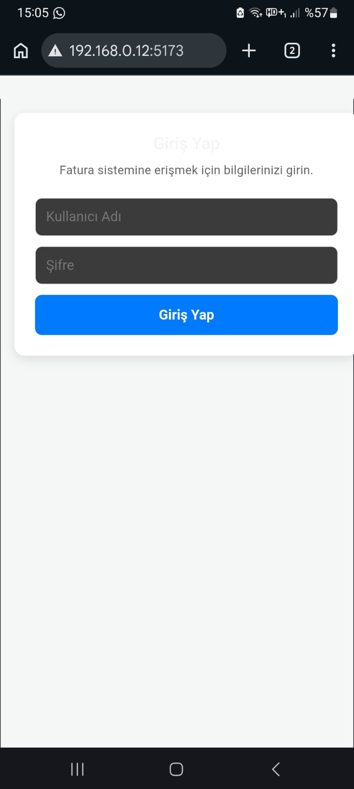
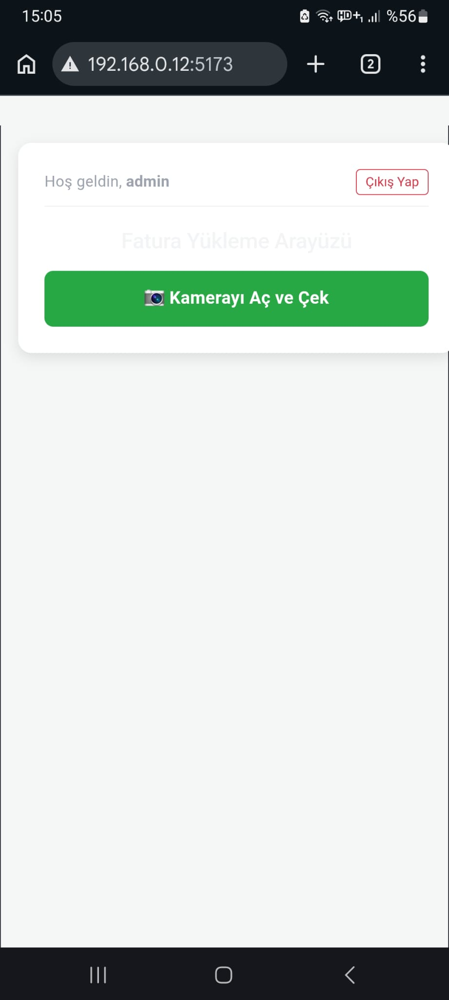
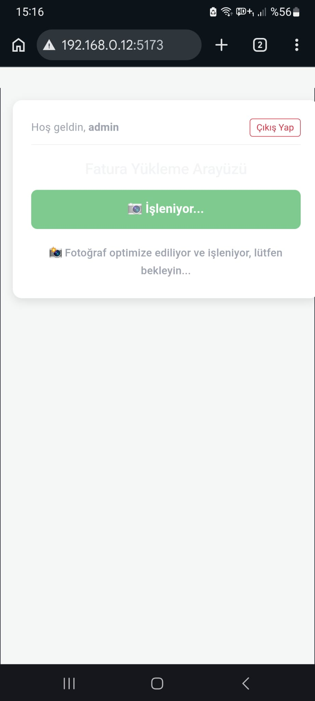
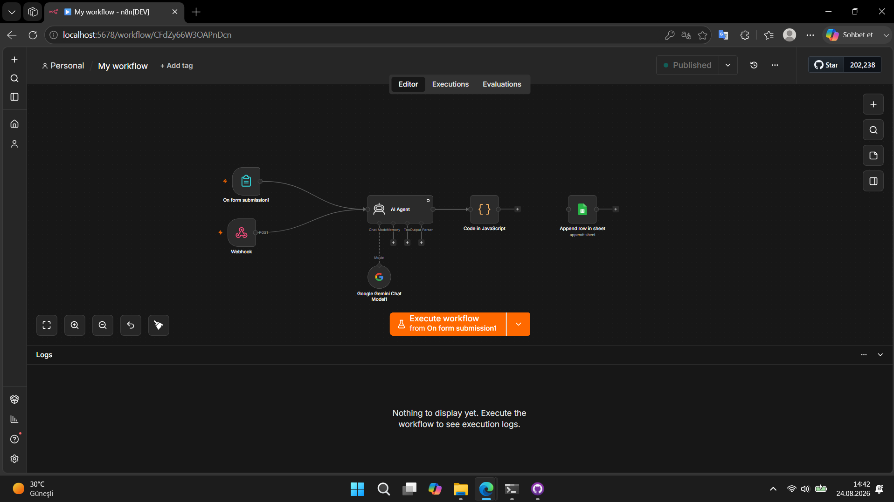
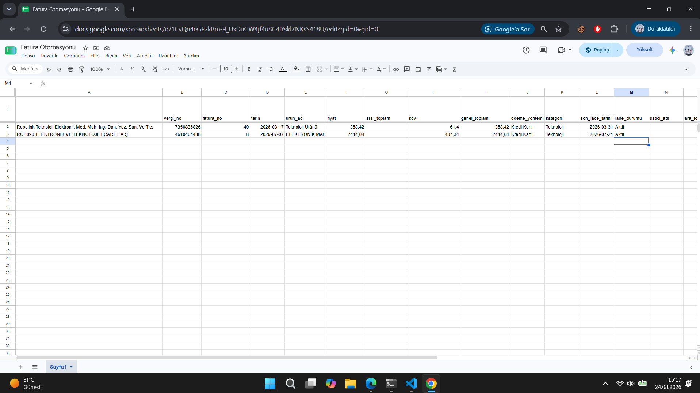

# AI Destekli Fatura & Fiş Muhasebe Otomasyonu (ERP & Google Sheets Entegrasyonu)

Bu proje; şirketlerin ve muhasebe departmanlarının fiş, fatura ve harcama belgelerini manuel olarak ERP veya muhasebe sistemlerine işleme yükünü ortadan kaldırmak amacıyla geliştirilmiş uçtan uca bir otomasyon çözümüdür. Mobil uyumlu React arayüzünden yüklenen veya kamerayla anlık çekilen faturalar, Google Gemini 2.0 Flash Vision AI ile analiz edilerek yapılandırılmış veriye dönüştürülür ve n8n orkestrasyonu üzerinden hedef ERP / Google Sheets tablolarına aktarılır.

---

## 📸 Ekran Görüntüleri ve Sistem Akışı

### 1. Mobil İstemci ve Kullanıcı Girişi
Yetkisiz kişilerin sisteme fatura göndermesini engellemek için personele özel kullanıcı adı ve şifre doğrulaması sunulur. Giriş yapıldıktan sonra doğrudan mobil kamera veya galeri seçeneğiyle belge yüklenir.

| Kullanıcı Girişi | Fatura Çekme / Yükleme | İşleme Durumu |
| :---: | :---: | :---: |
|  |  |  |

---

### 2. n8n İş Akışı (Orkestrasyon)
Gelen ham görsel ikili veri (binary) olarak karşılanır, Gemini 2.0 Vision modeliyle finansal parametreler ayıklanır ve JavaScript düğümü üzerinden veri temizliği yapılarak Google Sheets / ERP API servisine fırlatılır.



---

### 3. Hedef Sistem / Google Sheets Canlı Veri Kaydı
Yapay zeka ve n8n akışından geçen fatura verileri; satıcı adı, vergi numarası, fatura numarası, KDV matrahı, iade süresi ve iade durumu gibi 13 farklı muhasebe sütununa saniyeler içinde işlenir.



---

## 🚀 Temel Özellikler

* **Mobil Uyumlu & Kameralı Arayüz:** Mobil tarayıcılar üzerinden doğrudan kamera tetikleme ve görsel boyut optimizasyonu.
* **Gelişmiş Vision OCR (Google Gemini 2.0 Flash):** Karmaşık, eğik veya silik faturalardan bile satıcı adı, vergi no, tarih, KDV, ara toplam ve genel toplamı yüksek doğrulukla ayıklama.
* **Finans & İade Takip Mantığı:** Belge tarihine göre otomatik 14 günlük son iade tarihi hesaplama ve iade/değişim statüsü takibi.
* **ERP Entegrasyon Hazırlığı:** REST API, Webhook ve Google Sheets API desteği sayesinde Logo, SAP, Mikro ve Nebim gibi ERP yazılımlarına kolay entegrasyon.

---

## 🛠️ Mimari ve Teknoloji Yığını

* **Frontend:** React.js, Vite, Axios
* **Workflow Automation Engine:** n8n
* **Görüntü İşleme / AI:** Google Gemini 2.0 Flash
* **Veri Depolama & Çıktı:** Google Sheets API, ERP Webhook / REST Endpoint

---

## ⚙️ Kurulum ve Çalıştırma

### 1. n8n İş Akışını İçe Aktarma
1. n8n arayüzünü (`http://localhost:5678`) açın.
2. `workflows/FATURA.json` dosyasını n8n içine import edin.
3. **Google Gemini** ve **Google Sheets** kimlik bilgilerinizi (Credentials) tanımlayın.
4. Akışı **Active / Published** konumuna getirin.

### 2. React Arayüzünü Başlatma
```bash
cd fatura-app
npm install
npm run dev -- --host
